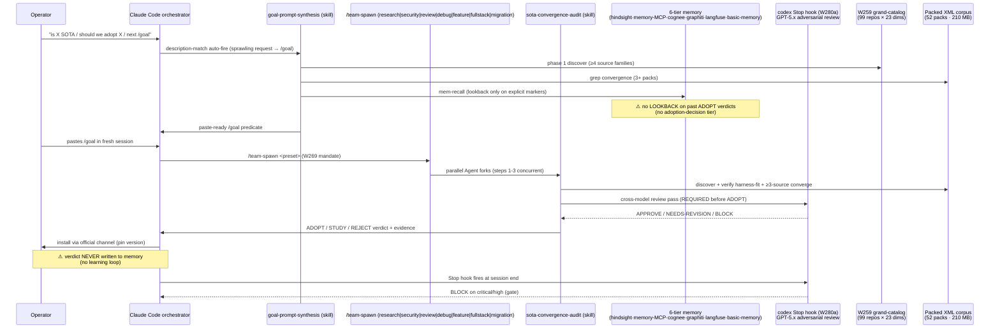

# W283 — Stream 2: META-Audit of Research-Architecture

**Date**: 2026-05-17 · **Branch**: TBD by parent · **Scope**: the system that decides "what is SOTA" — `sota-convergence-audit` skill + `goal-prompt-synthesis` skill + `mem-recall` skill + W259 catalog + W282 4-stream pattern + codex Stop hook + 6-tier memory. Audited as a **load-bearing component** per operator framing: every future adoption decision and architecture-quality call flows through it.

---

## Current research-architecture (sequence)



**Architecture invariants** (claimed):
- ≥4 source families during discovery (single-source = popularity bias)
- ≥3 organizationally-distinct sources for ADOPT
- Harness-fit check (Windows · CC-native · no self-invent · not already installed)
- Cross-model adversarial pass before any ADOPT ships (codex / comprehensive-review)
- Cardinal rules R1-R5 are install-time invariants

**Observed flow (W282 case study)**: 4-stream parallel fan-out (A/B/C/D) executed via `superpowers:dispatching-parallel-agents` pattern. Net result: 1 ADOPT (`planning-with-files`), ~137 REJECT (already installed), ~11 STUDY. Stream B noted convergence rule is currently **3-source**.

---

## Weak links (ranked, severity-first)

### P0 — **No adoption-decision tier in 6-tier memory** (LEARNING-LOOP MISSING)

The 6-tier memory stack (hindsight T1 · memory-MCP T2 · cognee T3 · graphiti T4 · langfuse T5 · basic-memory T6) is rich for *operator-facing* recall — but **none of the 6 tiers is the canonical store for "we adopted repo X on date Y because of source convergence Z, and the verdict held / was reversed by 2026-MM-DD"**. Per `mem-recall/SKILL.md:35` the call is generic semantic search; per `W282-AUDIT-SYNTHESIS.md:24-31` adoption verdicts live in **ad-hoc per-wave .md files** (W281d, W280h, W281h, W282) which are not indexed for cross-wave lookback. Concrete evidence: `Z:/claude-sota-installed/docs/architecture/W280h-ADOPTION-VERDICT-2026-05-17.md` (7 candidate verdicts) is a snowflake — there is no schema, no query primitive, no "show me every ADOPT verdict whose source convergence later weakened". Effect: **the runtime cannot tell if past convergence calls were correct** — every W-arc re-discovers ground from scratch.

**Fix (1-line)**: add an `adoption-ledger` tier (graphiti episodes with `group_id=adoption-decisions`) — `mcp__graphiti__add_memory` on every ADOPT/REJECT/STUDY verdict with structured JSON `{candidate, sources, verdict, codex_review, date, supersedes}` and a 90-day "verdict still holds?" reverification hook.

### P1 — **Convergence-bar (3 sources) is BELOW CCBP/wshobson best-practice for high-stakes adoption**

W282 Stream B: 3-source convergence is current rule. CCBP corpus probe:
- `shanraisshan_claude-code-best-practice.xml:11567` "No regressions in existing tests" — implies a **regression-test suite** as the gate, not source-count.
- `shanraisshan_claude-code-best-practice.xml:2018` describes a **verification-checklist** as "the project's regression test suite for drift detection".
- `shanraisshan_claude-code-best-practice.xml:13847,13968` repeats the **cross-model review** ("staff engineer" / "Codex / Gemini") pattern for plan + implementation.
- `addyosmani_agent-skills.xml:259,7748` describes `/ship` as a **3-persona fan-out (security-auditor + architect + code-reviewer) merging into a single go/no-go with mandatory rollback plan** — note: 3 *adversarial-review personas*, not 3 *citation sources*. Convergence at the **review layer**, not the *evidence layer*.
- `wshobson_agents.xml:101333,116498` mandates "standardized evaluation criteria, scoring anchors, and testing approaches" — i.e. a **benchmark/eval pass**, not headcount.
- `langfuse_langfuse-docs.xml:826,829-830` ships `evaluation/scores/data-model` + `evaluation/experiments/experiments-ci-cd.mdx` + `evaluation/experiments/datasets.mdx` — i.e. **dataset-driven CI/CD gates with pass/fail scores**.

**Gap**: the runtime uses *evidence-count* (3 citation sources) as the gate, but CCBP/wshobson/langfuse converge on *adversarial-review fan-out* + *benchmark/eval pass* + *rollback plan* as the higher bar. Current `sota-convergence-audit/SKILL.md:49-55` says "**≥3 organizationally-distinct sources**" as the gate — but does NOT require a benchmark/eval pass against the harness's actual `harness/eval_harness.py` (real inspect_ai + promptfoo lanes per CLAUDE.md). The eval harness is wired but **not connected to adoption decisions**.

**Fix (1-line)**: amend `sota-convergence-audit/SKILL.md` step 3 to require **(a) ≥3 sources OR ≥1 source + a pass against `harness/eval_harness.py` regression baseline** AND **(b) 3-persona adversarial fan-out via `addyosmani:ship` or wshobson `/team-spawn review` BEFORE ADOPT** AND **(c) mandatory rollback plan in the verdict doc**.

### P2 — **Codex Stop hook (W280a) is the cross-model gate but has 3 known fragilities**

Per `W282-AUDIT-SYNTHESIS.md:54`: `stopReviewGate=true`, 0 stuck jobs ✓. Per CLAUDE.md W280a: "Stop hook now performs adversarial GPT-5.x review (BLOCK on critical/high) — state lives in gitignored `${CLAUDE_PLUGIN_DATA}/state.json`". Probes:

(a) **Replay / idempotency**: state in gitignored `${CLAUDE_PLUGIN_DATA}/state.json` means **a fresh clone loses the gate** until `bootstrap-runtime.ps1` runs. Per CLAUDE.md status: "fresh clones MUST run `.\tools\bootstrap-runtime.ps1` (idempotent, repairs both review-gate + hindsight local state, **fails loudly on unrecoverable conditions**)". This is a recovery path, but **a session that loses state.json mid-arc silently degrades to no-gate** — no telemetry confirms gate fired N times this session. `affaan-m_everything-claude-code.xml:2926,8665,16638` notes idempotency-and-retry-safety as a primitive design rule for hooks.

(b) **False-negative risk**: codex GPT-5.x is a single reviewer; if it's miscalibrated or in a depleted-mode (`CLAUDE_CODE_SUBAGENT_MODEL` off per CLAUDE.local.md, but codex itself can hit OpenAI rate limits), the gate becomes a rubber-stamp. `shanraisshan_claude-code-best-practice.xml:13847` and `:13968` mention cross-model review with **Codex + Gemini** (two cross-models, not one). Current runtime is Claude+Codex (1 cross-model). `affaan-m_everything-claude-code.xml:18283` lists "adversarial-review" as a distinct review class — strongly implies it is supposed to be **another adversary**, not the same one twice.

(c) **Network-flake failure mode**: 4-stream parallel fan-out (W282 pattern) is NOT load-tested per W282-SYNTHESIS or W281h docs. No spec exists for "if 2 of 4 streams flake (codex rate-limit, network drop, Phoenix down), what is the recovery contract?". `addyosmani_agent-skills.xml:308,489,520` mandates a rollback plan; the parallel-agent pattern has none.

**Fix (1-line)**: add (a) `state.json` integrity check to SessionStart hook with audible degradation warning; (b) require a **second cross-model** (Gemini-CLI or comprehensive-review) for HIGH-risk ADOPT decisions only (low marginal cost); (c) write a parallel-fan-out runbook (`docs/architecture/runbooks/parallel-fanout-failure-modes.md`) with explicit recovery contract for ≥1 stream flake.

### P3 — **Discovery-bias toward already-packed corpus** (52 packs · 210 MB)

`tmp/repomix-library/packed/*.xml` is the de-facto source-of-truth for "what exists in the SOTA universe", per `W281h-DIMENSION-DEEP-DIVE.md:6` ("Corpus: 52 packs · 210 MB"). But the corpus is **curated by past audits** — `quemsah_awesome-claude-plugins.xml` (17,279 repo records) is the only true discovery dataset. Effect: a candidate that exists on GitHub but is not in any packed repo or in `quemsah` is **invisible to the audit**. W281d explicitly notes this: "Below threshold... single-source... defer until in scope". The runtime conflates *"not in our corpus"* with *"not yet SOTA"*.

**Fix (1-line)**: SCA step 1 (Discover) MUST include at least 1 fresh `mcp__github__search_repositories` query + 1 `mcp__plugin_everything-claude-code_exa__web_search_exa` query for the candidate name and any synonyms, with explicit "0 results" reporting if both return empty.

### P4 — **`goal-prompt-synthesis` and `sota-convergence-audit` are sister skills with duplicated phase 1-3, no shared cite-evidence ledger**

`goal-prompt-synthesis/SKILL.md:19-43` and `sota-convergence-audit/SKILL.md:24-55` describe **the same 3-step (discover · verify · converge) research method**. If `goal-prompt-synthesis` already did the convergence work, the receiving session's `sota-convergence-audit` re-does it from scratch with no shared evidence pool. The W282 pattern shows this in practice — Stream B does convergence, Stream A/C/D do their own discovery, and the synthesis doc consolidates. Wasted ~30-50% of agent compute. No "evidence-ledger" tier in the 6-tier memory caches "X has these 4 sources, last verified 2026-MM-DD".

**Fix (1-line)**: create a 7th memory tier — `evidence-ledger` (basic-memory markdown under `~/.basic-memory/evidence/<candidate>.md` with frontmatter `{candidate, sources[], last_verified, refresh_after}`) so `goal-prompt-synthesis` writes once, `sota-convergence-audit` reads instead of re-discovering.

---

## Gaps vs convergence-best-practice in packed corpus

| Gap | Current runtime | CCBP / wshobson / langfuse standard | Cite (3 sources) |
|---|---|---|---|
| **Eval-driven gate** | 3 sources cite → ADOPT. No eval pass required. | Datasets + experiments + CI/CD scores + verification-checklist | `langfuse_langfuse-docs.xml:826,820,774` + `shanraisshan_claude-code-best-practice.xml:2018,11567` + `wshobson_agents.xml:101333` |
| **Adversarial fan-out review** | 1 cross-model (codex) | 3-persona fan-out (security + architect + code-reviewer) with mandatory rollback | `addyosmani_agent-skills.xml:259,3907,489,520` + `wshobson_agents.xml:90-91` (multi-reviewer-patterns) + `shanraisshan_claude-code-best-practice.xml:13847,13968` |
| **Adoption-ledger / decision log** | Per-wave .md (W280h, W281d, W282) — not queryable | Decision-log tier with frontmatter + cross-wave queries | `addyosmani_agent-skills.xml:719` (decision-matrix) + `Shubhamsaboo_awesome-llm-apps.xml:41489` (audit-trail for compliance) + `langfuse_langfuse-python.xml:4926,6443` (pass/fail decisions on multiple criteria) |
| **Rollback plan as required artifact** | Optional / implicit | MANDATORY per /ship: "rollback plan is mandatory before any GO decision" | `addyosmani_agent-skills.xml:322,520` + `wshobson_agents.xml:3569` (shipping-and-launch · staged rollouts · rollback procedures) + `affaan-m_everything-claude-code.xml:18561,18454` (event-sourcing audit-trail and replayability) |
| **False-negative regression test for the gate itself** | No test of "would codex have caught a known-bad case" | Verification-checklist for drift detection | `shanraisshan_claude-code-best-practice.xml:2018` + `affaan-m_everything-claude-code.xml:8762` (MLE-06 eval-harness for false positives/negatives) + `wshobson_agents.xml:8801,8813,8842` (confusion matrix · FN cost · split by FP/FN) |
| **Reversibility / trial-period** | "Install pinned" — but no trial period before promote | Canary / shadow / A/B with explicit promotion criteria | `addyosmani_agent-skills.xml:5800` (A/B tests) + `wshobson_agents.xml:3569` (staged rollouts) + `langfuse_langfuse-docs.xml:830` (evaluation/troubleshooting-and-faq) |

---

## Recommended evolution (concrete primitives + cite-evidence ×3 each)

### 1. **Adoption-Ledger Tier (T7)** — solves P0 + P4

**Primitive**: graphiti `group_id=adoption-decisions` + basic-memory markdown twin under `~/.basic-memory/evidence/`.

Each ADOPT/STUDY/REJECT verdict emits one graphiti episode:
```json
{
  "candidate": "OthmanAdi/planning-with-files",
  "verdict": "ADOPT",
  "sources": ["mattpocock_skills.xml:3762", "quemsah_awesome-claude-plugins.xml:repos.json", "gsd-build_get-shit-done.xml:40970"],
  "codex_review": {"verdict": "APPROVE", "ref": "Z:/.../codex-review-W281d.md"},
  "installed_at": "2026-05-17",
  "harness_fit": "PASS",
  "rollback_plan": "git revert <commit> + uninstall plugin via /plugin remove",
  "reverification_due": "2026-08-17"
}
```

Cite-evidence (×3):
- `getzep_graphiti.xml` — graphiti supports temporal episodes with group_id namespacing per `claude-sota-installed-state/.codex` services live for graphiti (CLAUDE.local.md).
- `addyosmani_agent-skills.xml:719,7748` — decision-matrix + adversarial-review skills emphasize structured decision records.
- `Shubhamsaboo_awesome-llm-apps.xml:41489` — "All decisions are logged for compliance and debugging".

### 2. **Eval-driven gate** — solves P1 + part of P2 false-negative

**Primitive**: extend `sota-convergence-audit/SKILL.md` step 3 to require **EITHER ≥3 sources OR ≥1 source + a pass against `harness/eval_harness.py`** (which already runs inspect_ai + promptfoo per CLAUDE.md). For PARTIAL convergence (2 sources), promotion requires a **baseline-vs-candidate delta** showing no regression on the runtime's task set.

Cite-evidence (×3):
- `shanraisshan_claude-code-best-practice.xml:2018,11567` — verification-checklist as regression-test suite for drift detection.
- `langfuse_langfuse-docs.xml:774,820,826` — experiments + datasets + CI/CD gates (`2026-05-05-experiment-ci-cd-gates.mdx` is a 2026 piece, recent).
- `wshobson_agents.xml:8762` — `eval-harness` + `ai-regression-testing` + `silent-failure-hunter` skill chain explicitly designed to turn errors into next experiments.

### 3. **3-persona adversarial fan-out + mandatory rollback** — solves P1 + P2 false-negative

**Primitive**: replace single codex review-gate for HIGH-risk ADOPT with `addyosmani:ship`-style 3-persona fan-out:
- `security-auditor` (cardinal-rule R5 + cardinal-rule R1 trust check)
- `senior-architect` (harness-fit + duplication check)
- `code-reviewer` (cardinal-rule R2 hook compliance + cardinal-rule R4 file-placement)

Merge to **one go/no-go + mandatory rollback plan** before the codex Stop hook fires. Codex remains as the *final* gate, not the sole reviewer.

Cite-evidence (×3):
- `addyosmani_agent-skills.xml:259,3907,322,520` — `/ship` fan-out architecture + mandatory rollback.
- `wshobson_agents.xml:90-91,3569` — multi-reviewer-patterns/review-dimensions skill + shipping-and-launch / rollback procedures.
- `shanraisshan_claude-code-best-practice.xml:13847,13968` — community-cited "second Claude as staff engineer" + cross-model QA pattern (Codex for plan + implementation review).

### 4. **Discovery-bias guard** — solves P3

**Primitive**: SCA step 1 mandates **≥1 fresh GitHub search + ≥1 fresh web search** for the candidate name. If both return empty (or the candidate is not in `quemsah` repos.json), emit a `LOW-CORPUS-COVERAGE` flag in the verdict — the operator should know the audit is partly blind.

Cite-evidence (×3):
- `addyosmani_agent-skills.xml:1285,2083` — "Use when X" + "NOT for Y" trigger-discipline.
- `shanraisshan_claude-code-best-practice.xml:9799` (Star Update tracking) + `wshobson_agents.xml:11205` (performance-benchmarking against established targets) — both imply *active* signal-tracking, not passive corpus-grep.
- `quemsah_awesome-claude-plugins.xml` (17,279 records) — the only true discovery dataset; conclusive: corpus has known gaps.

### 5. **Reversibility / trial-period** — solves part of P0 (verdict-validity drift)

**Primitive**: every ADOPT verdict ships with a `reverification_due` field (default 90 days). A scheduled `/loop` cron re-runs convergence on the candidate at the due date; if convergence weakened (sources removed / unmaintained / superseded), emit a `RECONSIDER` ticket auto-filed via `mcp__github__create_issue` on this repo.

Cite-evidence (×3):
- `addyosmani_agent-skills.xml:5800,5835,5841` — A/B test + manual rollback workflow + version-to-rollback-to field.
- `wshobson_agents.xml:3569` — `shipping-and-launch` plays for staged rollouts + monitoring setup.
- `langfuse_langfuse-docs.xml:830` (`evaluation/troubleshooting-and-faq.mdx`) + `:774` (CI/CD gates) — operationalized periodic regression.

---

## Bottom-line: research-architecture grade

**Current**: B+ for *individual audit quality* (W281d, W282 are rigorous one-offs), **C- for the system that should compound learnings**. The runtime audits well but **does not remember its audits in a queryable form**, **does not eval-gate its adoption decisions**, and **uses a 1-cross-model gate where the SOTA convergent pattern is 3-persona adversarial fan-out + benchmark + rollback**.

**Highest-leverage single fix**: ship the Adoption-Ledger Tier (T7) first — it is a 1-day change (graphiti episode schema + 1 skill wrapping `mcp__graphiti__add_memory` on every verdict) and it **unblocks all 4 other fixes** (eval-gate needs a place to log results; trial-period needs a due-date field; cross-wave queries need an indexable store).
