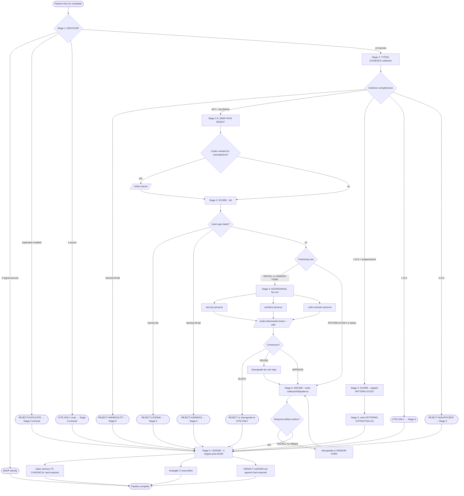

# W288 Stream D — Convergence + Ingest Pipeline (research-arch v2)

> **Wave**: W288 research-architecture v2 sweep · **Stream**: D · **Date**: 2026-05-18
> **Scope**: Design the cost-aware, multi-MCP, multi-source convergence + ingest pipeline that operationalizes the user mandate "for high quality SOTA repos, read and ingest with deepwiki, repomix etc, using SOTA methods to improve your workflow". This is the **operational runbook + JSON schemas + decision trees** that Stream B (discovery) and Stream C (rubric v3) plug into.
> **Sister streams**:
> - Stream A — research methodology (multi-angle source families)
> - Stream B — SOTA repo discovery sweep (find new candidates)
> - Stream C — multi-dimensional scoring rubric v3 (extends sca v2)
> - **Stream D — THIS DOC** (the pipeline glue + ledger writes)
> **Cite-anchor**: extends `sota-convergence-audit/SKILL.md` v2 (W284 typed-evidence + W287 P1a eval-harness lane). All ledger writes mirror v2 schema with v3 tier extensions per Stream C.

> **W290-P0a + W295-codex-r7 SUPERSEDES (2026-05-18)**: T4 Graphiti is RETIRED per `W272-operator-decisions-2026-05-17.md` codex APPROVE (Option B-refined) + W290 `disabledMcpjsonServers` + W295 full-scrub. All graphiti references below in §0 per-stage contract (L41), §6 LEDGER (§6.1-§6.5 already scrubbed via W295-codex-r7 cherry-pick), §8 degradation, §9/§10 diagrams are HISTORICAL — the canonical Stage-6 LEDGER write contract is **basic-memory T6 (CANONICAL, hard-required) + hindsight T1 (warm tier, best-effort) + VERDICT-LEDGER append (HARD-REQUIRED git-tracked)** ONLY. The `mcp__graphiti__add_memory` call is NOT part of the canonical Stage-6 sequence. §6.2 episode schema retained as historical reference for future temporal-KG backend swaps.

---

## §0 — Pipeline overview (6-stage funnel)

The pipeline is a **funnel that gets more expensive as candidates move down it** — Stage 1 is cheap and broad, Stage 6 is the durable ledger write. Each stage has a short-circuit upward: a clear REJECT or CITE-ONLY at Stage 2 skips Stages 3-5 and writes a minimal Stage 6 entry. ADOPT-class candidates are the only ones that pay the full pipeline cost.

```
┌─────────────┐   ┌──────────────────┐   ┌──────────┐   ┌─────────────┐   ┌────────────┐   ┌──────────┐
│ DISCOVER    │ → │ TYPED-EVIDENCE   │ → │ SCORE    │ → │ ADVERSARIAL │ → │ DECIDE     │ → │ LEDGER   │
│ (cheap)     │   │ (escalating)     │   │ (v3)     │   │ (3-persona) │   │ (tier)     │   │ (persist)│
│ ~500 t/cand │   │ ~1-30k t/cand    │   │ pure     │   │ ~10k t      │   │ pure +     │   │ ~1k t    │
│ parallel    │   │ parallel ≤8      │   │ compute  │   │ + codex     │   │ rollback   │   │ T1+T4+T6 │
└──────┬──────┘   └────────┬─────────┘   └────┬─────┘   └──────┬──────┘   └─────┬──────┘   └─────┬────┘
       │  REJECT short-circuit (Stage 6 minimal entry)                                            │
       └─────────────────────────────────────────────────────────────────────────────────────────►│
                          │  CITE-ONLY short-circuit (Stage 6 cite-only entry)                    │
                          └───────────────────────────────────────────────────────────────────────►
```

### Per-stage contract

| Stage | Input | Output | Tool (primary) | Tool (fallback) | Cost budget | Short-circuit upward |
|---|---|---|---|---|---|---|
| **1 DISCOVER** | source_family, seed_query | candidate_card[] | mcp__github__search_repositories · WebSearch · mcp__deepwiki | mcp__plugin_everything-claude-code_exa__web_search_exa · awesome-list grep | <500 t / candidate; <5 min total | "0 signal-sources → drop silently" or "duplicates installed primitive → REJECT minimal-entry" |
| **2 TYPED-EVIDENCE** | candidate_card | evidence_pack | repomix-xml Grep · mcp__deepwiki__ask_question · mcp__github__get_file_contents | mcp__plugin_context-mode_context-mode__ctx_fetch_and_index · WebSearch | 1-5k t / candidate; <15 min batch ≤8 parallel | "all three typed sources MISSING for non-ADOPT-class → CITE-ONLY at Stage 6" or "harness-fit fail → REJECT" |
| **2.5 DEEP-DIVE INGEST** | evidence_pack (ADOPT-class only) | architecture_extract | mcp__deepwiki__read_wiki_contents · repomix-xml Grep · mcp__serena__find_symbol · mcp__gitnexus__context | mcp__github__get_file_contents tree-walk · ctx_execute on local clone | 5-30k t / candidate; <30 min per | "license is non-OSI and runtime needs commercial-use → CITE-ONLY" |
| **3 SCORE** | evidence_pack + architecture_extract | score_card | (pure compute — Stream C v3 rubric) | none | <100 t / candidate; <1 min | "hard-cap dimension failed → REJECT" |
| **4 ADVERSARIAL** | score_card | adversarial_verdict | Agent forks (security/architect/code-reviewer personas) · /codex:adversarial-review --wait | /team-spawn review (preset) | ~10k t + 30-60s codex wall-clock | "any persona BLOCK + codex BLOCK → REJECT" |
| **5 DECIDE** | adversarial_verdict | tier_verdict + rollback_plan | (pure compute + Write tool for rollback md) | none | <1k t / candidate | "ADOPT without rollback plan → downgrade STUDY-PILOT" |
| **6 LEDGER** | tier_verdict | persisted note + audit-row | **mcp__basic-memory__write_note (T6 CANONICAL, hard-required, `directory="verdicts"`)** · hindsight T1 SDK (warm, best-effort) · Edit VERDICT-LEDGER.md | T6 down = pipeline BLOCKS (operator must repair) | <1k t / candidate; <20s per | none — terminal stage. **W290-P0a + W295**: graphiti T4 RETIRED — removed from canonical write tool-list. |

### Throughput / parallelism envelope

- Stage 1 fan-out runs **all source families in parallel** (concurrency 4-8) via `mcp__plugin_context-mode_context-mode__ctx_batch_execute` `concurrency: 4-8`.
- Stage 2 batches **≤8 candidates concurrently** via Agent forks; each fork is owner-bound to one candidate's `evidence_pack`.
- Stage 2.5 is **serial per candidate** but multiple ADOPT-class candidates can run their own Stage-2.5 pipelines concurrently (worktree-isolated if local cloning).
- Stage 4 runs the 3 persona forks **in parallel**, then codex serially after consensus.
- Stages 5 and 6 are **serial per candidate** (no parallelism benefit; small).

---

## §1 — Stage 1: DISCOVER (cheap, broad)

### 1.1 Input

```yaml
discover_invocation:
  wave: W<n>
  source_families: [<see §1.2>]
  seed_queries: [<topic strings>]
  exclude_already_cataloged: true   # cross-check against W259 grand catalog + installed plugins
  budget_total_minutes: 5
  budget_per_family_minutes: 2
```

### 1.2 Source families (Stream A defines the canonical list)

For Stream D the operational list is:

1. **GitHub search** — `mcp__github__search_repositories` for `topic:<term>`, `language:<lang>`, `stars:>N`, `pushed:>2026-01-01`. Multiple queries per topic to widen recall.
2. **Awesome-list scrape** — Grep the local clones at `Z:/claude-sota-installed-repos/hesreallyhim-awesome-claude-code/`, `ComposioHQ-awesome-claude-skills`, `github-awesome-copilot`, `shubhamsaboo_awesome-llm-apps` for any line containing the seed query AND a github.com link.
3. **DeepWiki** — `mcp__deepwiki__ask_question(repo, question="What other repos are commonly cited alongside <topic>?")` against curated meta-repos (anthropics/skills, modelcontextprotocol/registry).
4. **MCP registry** — `mcp__github__get_file_contents(owner="modelcontextprotocol", repo="registry", path="<registry>.json")`.
5. **HN Algolia** — WebSearch `<topic> site:news.ycombinator.com 2026`.
6. **Recent Anthropic** — `mcp__deepwiki__ask_question(repo="anthropics/claude-code", question="<topic>")` + `mcp__deepwiki__ask_question(repo="anthropics/skills", question="<topic>")`.
7. **PapersWithCode / OpenAlex** (academic side) — WebSearch `<topic> "papers with code"` or `<topic> site:openalex.org`.
8. **Exa / Perplexity (if available)** — `mcp__plugin_everything-claude-code_exa__web_search_exa` for semantic-search distinct from keyword search.

### 1.3 Output: candidate_card

One per discovered repo:

```yaml
candidate_card:
  candidate: <owner>/<repo>      # slug
  capability_claim: "<one-line: what the README says it does, verbatim or near-verbatim>"
  source_families_hit:           # families that surfaced it
    - github_search
    - awesome_list
    - deepwiki
  github_stars: <int or null>
  github_pushed: <ISO or null>
  topic_match: <seed_query>
  duplicates_installed: <slug or null>   # if MCP / plugin / skill already installed
  notes: "<short>"
```

### 1.4 Cost guards

- Each `mcp__github__search_repositories` call returns up to 30 — cap at 3 queries per topic.
- Awesome-list grep is local-only, near-free; run it FIRST to seed the candidate set.
- WebSearch budget: ≤5 queries per topic; cache hits via `mcp__plugin_context-mode_context-mode__ctx_fetch_and_index` (W286-cross MCP-server contract `npx -y <pkg>@<pin>`).

### 1.5 Triage at end of Stage 1

For each candidate_card, compute `signal_sources_count`:

| signal_sources_count | candidate_card.next_stage |
|---|---|
| 0 (only one weak source) | DROP silently (no ledger entry) |
| 1 | CITE-ONLY route → Stage 6 minimal entry |
| ≥2 | Stage 2 |
| `duplicates_installed != null` | REJECT-DUPLICATE → Stage 6 minimal entry (no Stage 2-5) |

---

## §2 — Stage 2: TYPED-EVIDENCE collection (medium cost)

### 2.1 The three typed types (per sca v2 §3)

Stream D operationalizes each type with a tool ladder (primary → fallback):

#### benchmark (measured metric, NOT README claim)

| Tool | When | Cost |
|---|---|---|
| Pre-packed repomix XML at `Z:/claude-sota-installed/tmp/repomix-library/packed/<owner>_<repo>.xml` (Grep for `benchmark`, `eval`, `score`, `%`, `latency`) | If pre-packed (23 priority repos) | ~free |
| `mcp__github__get_file_contents(path="benchmarks/")` + tree-walk | If repo has `benchmarks/` or `evals/` dir | ~500 t |
| `mcp__deepwiki__ask_question(repo, question="What measured benchmark results does the project report? Give numbers + baseline + metric.")` | Always (canonical question) | ~1k t |
| `python harness/eval_harness.py --lane inspect_ai --candidate <slug>` | If candidate exposes benchmarkable surface (W287 P1a §4.5 conditions) | ~30s + traces |
| WebSearch `<repo> benchmark vs <incumbent>` | If above all return nothing | ~500 t |

**Discipline:** README claims without numbers do NOT count. Marketing-by-self do NOT count.

#### code_reading (file:line citation)

| Tool | When | Cost |
|---|---|---|
| **Grep on pre-packed repomix XML** | If `tmp/repomix-library/packed/<slug>.xml` exists (23 priority repos) | ~free |
| `mcp__github__get_file_contents(path="<key-file>")` after README points to entry-point | Else | ~500 t per file |
| `mcp__deepwiki__read_wiki_contents(repo)` then drill into source-tree section | Else | ~2k t |
| `mcp__serena__find_symbol(name=<capability>)` | If local clone available | ~free |

**Discipline:** must be a file:line cite that DEMONSTRATES the capability is implemented, not just declared in docs.

#### practitioner_field_report (named-org outcome)

| Tool | When | Cost |
|---|---|---|
| WebSearch `"<repo>" production "we shipped" -site:github.com -site:<author-domain>` | Always | ~500 t |
| HN Algolia via WebSearch `<repo> site:news.ycombinator.com` | Always | ~500 t |
| `mcp__github__list_issues(owner, repo, state="closed", labels=["case-study","testimonial"])` if labels exist | Optional | ~500 t |
| Reddit thread search via WebSearch `<repo> site:reddit.com` | Optional | ~500 t |

**Discipline:** marketing claims by the candidate's own author do NOT count. Must be a named third-party org/practitioner with a dated artifact.

### 2.2 Output: evidence_pack schema

```yaml
evidence_pack:
  candidate: <slug>
  collected_at: <ISO8601>
  collector: "stream-D pipeline / W<n>"
  benchmark:
    - metric: <name>                          # e.g., "SWE-bench Lite pass@1"
      value: <float>
      unit: <str>                             # %, ms, tokens, etc.
      baseline: <slug or "none">              # incumbent or "none"
      delta_vs_baseline: <signed pct or null>
      source_url: <url>
      cite: <file:line OR full url>
      source_type: deepwiki|repomix|github|harness|websearch
      trace_id: <langfuse trace id or null>   # only if W287 P1a harness invoked
  code_reading:
    - claim: <capability-name>
      file: <path-in-repo>
      lines: <start>-<end>
      source: repomix-xml|github-api|deepwiki|serena
      cite: <full path or url>
      excerpt_chars: <int>                    # length of the cited fragment
  practitioner_report:
    - org: <name>                             # not the author org
      outcome: "<one-line>"
      source: <url>
      published: <ISO>
      author: <name or "anonymous">
  evidence_completeness:
    has_benchmark: <bool>
    has_code_reading: <bool>
    has_practitioner_report: <bool>
    organizationally_distinct: <bool>         # ≥3 distinct authors across the three types
  notes: "<free-text gaps or anomalies>"
```

### 2.3 Triage at end of Stage 2

```
if evidence_completeness has all three AND organizationally_distinct:
    → candidate is ADOPT-eligible → Stage 2.5
elif evidence_completeness has 2 of 3 AND candidate is uniqueness ≥ 4:
    → candidate is PATTERN-STUDY-eligible → skip Stage 2.5, go to Stage 3 with capped scoring
elif evidence_completeness has 1 of 3:
    → CITE-ONLY route → Stage 6 minimal entry
else:
    → REJECT-INSUFFICIENT-EVIDENCE → Stage 6 minimal entry
```

**Harness-fit fail at this stage (per sca v2 §2)**:
- assumes interactive operator → REJECT
- requires `.claude/hooks/scripts/*.py` self-invent → REJECT
- non-Windows-portable AND no documented Windows path → REJECT or downgrade to CITE-ONLY

---

## §2.5 — Stage 2.5: DEEP-DIVE INGEST (HIGH-COST, ADOPT-class only)

### 2.5.1 Trigger

Stage 2.5 fires ONLY when Stage 2 produced a complete `evidence_pack` AND the candidate's preliminary tier is INSTALL or VENDOR-FORK (per Stream C v3 tier ladder). PATTERN-STUDY-class candidates skip directly to Stage 3 with a capped score.

### 2.5.2 Tool ladder

| Tool | Output | When |
|---|---|---|
| `mcp__deepwiki__read_wiki_contents(repo, page="<section>")` (multi-page sweep) | full architecture narrative | Always |
| `mcp__deepwiki__ask_question` × 4-6 canonical questions | install topology, entry points, deps, license, recency | Always (parallel via batch) |
| **Grep on pre-packed repomix XML** for: `plugin.json`, `SKILL.md`, `.mcp.json`, `hooks`, `agents/`, `LICENSE`, `package.json`, `pyproject.toml` | install-artifact presence map | If pre-packed; else fallback |
| `mcp__github__get_file_contents` tree-walk on key dirs | install-artifact verification | Else |
| `mcp__serena__find_symbol` for top-N entry points | symbol-level evidence | If local clone present |
| `mcp__gitnexus__context(repo)` if local clone analyzed | dep-graph + community structure | Optional, expensive |
| `mcp__github__list_commits(owner, repo, since=<90d>)` | recency + contributor-distribution | Always |

### 2.5.3 Canonical questions (deepwiki ask_question, parallel)

Fire these 6 questions in one batch (parallel):

1. "What is the install topology? Does the project ship a `plugin.json`, `SKILL.md`, `.mcp.json`, hooks, or `agents/` directory? List file paths."
2. "What are the entry points (CLI commands, MCP tools, importable functions, skills, agents)? List them exhaustively."
3. "What is the LICENSE? Quote the SPDX identifier and any commercial-use restriction verbatim from the LICENSE file."
4. "What are the runtime, dev, and optional dependencies? Are they pinned via lockfile?"
5. "What is the latest release version, release date, and the release cadence over the last 90 days?"
6. "What are the documented failure modes, limitations, and known issues? Quote from RUNBOOK.md, GUARDRAILS.md, or top issues."

### 2.5.4 Output: architecture_extract schema

```yaml
architecture_extract:
  candidate: <slug>
  collected_at: <ISO8601>
  install_topology:
    - artifact: plugin.json
      present: <bool>
      path_in_repo: <path or null>
    - artifact: SKILL.md
      present: <bool>
      path_in_repo: <path or null>
      count: <int>                            # multiple skills supported
    - artifact: .mcp.json
      present: <bool>
      path_in_repo: <path or null>
    - artifact: hooks
      present: <bool>
      path_in_repo: <path or null>
      hook_kind: settings-json|self-invent-script|none
    - artifact: agents
      present: <bool>
      path_in_repo: <path or null>
      count: <int>
  entry_points:
    cli: [<command>, ...]
    mcp_tools: [<tool>, ...]
    skills: [<skill-name>, ...]
    agents: [<agent-name>, ...]
    library_exports: [<fn>, ...]
  dep_graph_summary:
    deps_count_runtime: <int>
    deps_count_dev: <int>
    deps_count_optional: <int>
    deps_lockfile: <true|false>
    deps_lockfile_path: <path or null>
    top10_runtime_deps: [<name>, ...]
    deps_with_known_cves: [<name>, ...]       # via osv.dev or trivy
  license:
    spdx: <SPDX or NOASSERTION>
    file_verified: <bool>                     # LICENSE file actually read, not just badge
    commercial_use_ok: <bool>
    permissive: <bool>                        # MIT/Apache/BSD = true; AGPL/BSL/PolyForm = false
    cite_file: LICENSE
    cite_lines: <range>
  recency:
    latest_commit_sha: <sha7>
    latest_commit_at: <ISO>
    latest_release_tag: <semver>
    latest_release_at: <ISO>
    release_cadence_days_p50: <float>         # median days between last 5 releases
    days_since_last_commit: <int>
  contributor_distribution:
    top1_committer_pct_90d: <float>            # bus-factor inverse
    distinct_committers_90d: <int>
    distinct_committers_alltime: <int>
    bus_factor_estimate: <int>                 # 1 = solo, 2-3 = small team, ≥4 = healthy
    is_anthropic_canonical: <bool>
    is_documented_anthropic_partner: <bool>
  failure_mode_disclosure:
    has_runbook: <bool>
    has_guardrails: <bool>
    has_known_issues_section: <bool>
    cite_failure_doc: <path or null>
    self_documents_limitations: <bool>
  windows_portability:
    documented_windows_path: <bool>
    requires_bash: <bool>
    requires_native_compile: <bool>
    posix_only_signals: [<signal>, ...]
  notes: "<free-text gaps>"
```

### 2.5.5 Cost

- 6 deepwiki questions in parallel: ~6k tokens.
- Grep on repomix XML: free.
- GitHub commits + tree-walk: ~3k tokens.
- Total budget: 5-30k tokens per ADOPT-class candidate.

### 2.5.6 Failure modes at Stage 2.5

| Failure | Recovery |
|---|---|
| deepwiki rate-limits or returns "I don't have enough information" | Fall back to mcp__github__get_file_contents tree-walk |
| repomix XML missing (not pre-packed) | Use github tree-walk; do NOT attempt mcp__repomix__pack_remote_repository (broken on Win v1.14.0 per hindsight memory) |
| Local clone unavailable AND deepwiki gap | Mark `notes: "DEEP-DIVE PARTIAL — re-run when clone available"` and proceed with degraded extract |
| License file unreadable | HARD-CAP — set `license.file_verified=false` and disallow tier above PATTERN-STUDY (cannot trust badge alone) |

---

## §3 — Stage 3: SCORE

Pure compute over `evidence_pack + architecture_extract` → `score_card`. No new probes.

### 3.1 Input

The Stream C v3 rubric (defined in `STREAM-C-RUBRIC-v3.md`). Stream D treats it as a black-box function `score(evidence_pack, architecture_extract) → score_card`.

### 3.2 Output: score_card schema

```yaml
score_card:
  candidate: <slug>
  computed_at: <ISO8601>
  rule_version: sca-v3
  install_score: <float 1-5>                  # ADOPT-vs-INSTALL track
  pattern_score: <float 1-5>                  # PATTERN-STUDY track
  dimension_scores:
    D01_capability_uniqueness: <int 1-5>
    D02_harness_fit: <int 1-5>
    D03_source_diversity: <int 1-5>
    D04_authority_weight: <int 1-5>
    D05_recency: <int 1-5>
    D06_benchmark_deltas: <int 1-5>
    D07_failure_mode_disclosure: <int 1-5>
    D08_claude_code_pathway_support: <int 1-5>      # Stream C v3 new
    D09_license_compatibility: <int 1-5>            # Stream C v3 new
    D10_supply_chain_safety: <int 1-5>              # Stream C v3 new
    D11_community_signal_distribution: <int 1-5>    # Stream C v3 new
    D12_pattern_extractability: <int 1-5>           # Stream C v3 new
  score_min: <int>
  score_mean: <float>
  hard_caps_failed: [<dimension-name>, ...]   # Stream C v3 hard caps
  soft_caps_applied: [<dimension-name>, ...]
  preliminary_tier: INSTALL | VENDOR-FORK | PATTERN-STUDY | CITE-ONLY | REJECT
  tier_rationale: "<one-paragraph why this tier>"
```

### 3.3 Tier classification (preliminary, before adversarial review)

The Stream C v3 ladder is consulted; Stream D simply applies the function. The 5 tiers, in adoption-depth order:

1. **INSTALL** — full install via plugin marketplace / `claude mcp add` / `npm install`; full pipeline cost paid; rollback plan mandatory.
2. **VENDOR-FORK** — fork into a vendored sub-path of this repo (e.g., `vendor/<repo>/`); drift-tracking + upstream-sync plan mandatory. Used when the upstream is high-value but maintenance is uncertain or license requires it.
3. **PATTERN-STUDY** — do NOT install; extract patterns into a SKILL.md, an architecture doc, or a code-snippet in `docs/architecture/W288-RESEARCH-ARCH-v2/PATTERNS-EXTRACTED/<slug>.md`. The repo never enters the runtime tree.
4. **CITE-ONLY** — record the repo in the catalog as a reference cite (a file:url anchor in docs), but no patterns extracted and no install.
5. **REJECT** — explicit do-not-revisit-this-wave verdict; reverification_due ≥ 12 waves out.

### 3.4 Short-circuit

```
if hard_caps_failed contains any of [D09_license_compatibility=1, D02_harness_fit=1]:
    preliminary_tier = REJECT (or CITE-ONLY if uniqueness ≥ 4)
    skip Stages 4-5, go directly to Stage 6 with minimal entry
```

---

## §4 — Stage 4: ADVERSARIAL review

### 4.1 Trigger

Stage 4 fires for `preliminary_tier ∈ {INSTALL, VENDOR-FORK}` only. PATTERN-STUDY and below skip directly to Stage 5 (pure compute, no adversarial fan-out needed for non-invasive verdicts).

### 4.2 3-persona fan-out (parallel)

Dispatch via either:

- **Solo path**: `superpowers:dispatching-parallel-agents` — 3 forks in one message.
- **Team path**: `/team-spawn review` preset (W269 mandate for any review with 2+ workstreams).

Each persona gets the full `evidence_pack + architecture_extract + score_card` and one prompt:

#### security persona

```
You are the security reviewer. Assess attack surface and supply-chain risk of adopting <slug>:
- Dependencies with known CVEs (cross-check against dep_graph_summary.deps_with_known_cves).
- Install-time scripts (postinstall, setup.py custom commands).
- Network calls at install or runtime (telemetry, registry).
- File-system mutations outside the candidate's own dir.
- Auth-flow / credential-handling.
- Floating @latest in install (vs pinned semver).

Verdict: APPROVE | REVISE | BLOCK.
If REVISE, list the exact mitigation steps.
If BLOCK, cite the file:line that triggered.
```

#### architect persona

```
You are the architecture reviewer. Assess fit + duplication of <slug>:
- Does it duplicate an installed primitive (cross-check against `.claude/plugins/config.json` and `.mcp.json`)?
- Does it violate any of the 5 cardinal rules (especially CR-2: no self-invent hook scripts; CR-4: no .claude/rules/*.md)?
- Does it require modifications to CLAUDE.md beyond the pointer-only ≤50-LOC discipline?
- Does it conflict with the 6-tier memory architecture or the 4-mode parallel-execution model?

Verdict: APPROVE | REVISE | BLOCK.
If REVISE, list the architectural changes required.
If BLOCK, cite the cardinal-rule number violated.
```

#### code-reviewer persona

```
You are the code-quality reviewer. Assess code-quality + abandonment-risk of <slug>:
- Lint/type errors in the candidate's own code.
- Test coverage signal (test/ dir presence, CI badges, codecov).
- API stability (semver discipline, deprecation policy).
- Bus-factor (cross-check against contributor_distribution).
- Last-90-day commit health.
- Outstanding critical issues in the issue tracker.

Verdict: APPROVE | REVISE | BLOCK.
If REVISE, list the code-quality concerns.
If BLOCK, cite the file:line or issue #.
```

### 4.3 Codex GPT-5.5 second-pass

After the 3 personas converge, fire codex once as the final cross-model gate:

```powershell
# Block until codex returns
/codex:adversarial-review --wait --candidate <slug> --evidence-pack <path> --score-card <path> --persona-verdicts <path>
```

Codex receives the full pack and returns APPROVE / REVISE / BLOCK. Per W280a stop-hook contract, ANY codex BLOCK is binding.

### 4.4 Output: adversarial_verdict schema

```yaml
adversarial_verdict:
  candidate: <slug>
  reviewed_at: <ISO8601>
  personas:
    security:
      verdict: APPROVE|REVISE|BLOCK
      findings: [<one-line>, ...]
      cite: [<file:line or issue#>, ...]
    architect:
      verdict: APPROVE|REVISE|BLOCK
      findings: [...]
      cite: [...]
    code_reviewer:
      verdict: APPROVE|REVISE|BLOCK
      findings: [...]
      cite: [...]
  codex_gate:
    verdict: APPROVE|REVISE|BLOCK
    findings: [...]
    rule_version: codex-stop-hook-W280a
    duration_seconds: <int>
  consensus: APPROVE|REVISE|BLOCK            # ANY BLOCK → BLOCK; else worst of [APPROVE, REVISE]
  blocking_dimensions: [<dimension-name>, ...]
```

### 4.5 Tier downgrade on REVISE / BLOCK

```
if consensus == BLOCK:
    preliminary_tier = REJECT (or CITE-ONLY if uniqueness ≥ 4)
elif consensus == REVISE:
    preliminary_tier = downgrade-one-step (INSTALL → VENDOR-FORK or VENDOR-FORK → PATTERN-STUDY)
    log: required_revisions = [<list>]
elif consensus == APPROVE:
    preliminary_tier = unchanged
```

### 4.6 Failure modes at Stage 4

| Failure | Recovery |
|---|---|
| Persona fork timeout / errors | Re-fire that ONE persona; if 2 of 3 fail, abstain → tier → STUDY-PILOT |
| Codex timeout / unavailable | Per W280a contract — codex unavailable = BLOCK (fail-closed). Tier → PATTERN-STUDY, with reverification when codex back |
| Codex returns "INSUFFICIENT CONTEXT" | Re-pack `evidence_pack` (verbose mode) and retry once; if still insufficient, downgrade tier one step |
| Personas split 1 APPROVE / 1 REVISE / 1 BLOCK | Hard rule: ANY BLOCK = consensus BLOCK. No "majority approve" interpretation |

---

## §5 — Stage 5: DECIDE + write rollback plan

### 5.1 Final tier classification

Apply the post-adversarial tier from Stage 4. If `preliminary_tier` survived Stage 4 unchanged, the final tier is `preliminary_tier`. Otherwise the downgraded tier.

### 5.2 Per-tier required artifacts

| Tier | Required artifact | Generation tool |
|---|---|---|
| INSTALL | `rollback_plan.md` — exact files, recovery time (minutes), smoke-test command, env-var inventory | Write tool, template below |
| VENDOR-FORK | `vendor_drift_plan.md` — fork-source URL, vendored-path, upstream-sync cadence (weekly/wave), conflict-merge owner | Write tool |
| PATTERN-STUDY | `docs/architecture/W288-RESEARCH-ARCH-v2/PATTERNS-EXTRACTED/<slug>.md` — extracted patterns + cite lines + applicability | Write tool |
| CITE-ONLY | Update `docs/architecture/W288-RESEARCH-ARCH-v2/CITES.md` (append one row) | Edit tool |
| REJECT | None beyond the ledger entry | none |

### 5.3 Rollback plan template (mandatory for INSTALL)

```markdown
# Rollback plan — <slug> · W<wave>

## Trigger
<one-line: what observable failure mode causes rollback?>

## Exact files to revert
- `<file1>` (created by install)
- `<file2>` (modified by install — git checkout HEAD~1 -- <file2>)
- `<file3>` (env-var addition — remove line from `.claude/settings.json:env`)

## Recovery time
~<N> minutes (verified by smoke test below)

## Smoke test to confirm rollback succeeded
```powershell
<exact command>
# Expected output: <exact match string>
```

## Re-install path (if rollback was wrong)
```powershell
<exact install command>
```
```

### 5.4 Output: tier_verdict schema

```yaml
tier_verdict:
  candidate: <slug>
  wave: W<n>
  decided_at: <ISO8601>
  decided_by: "stream-D pipeline + codex-stop-hook"
  rule_version: sca-v3
  tier: INSTALL|VENDOR-FORK|PATTERN-STUDY|CITE-ONLY|REJECT
  tier_rationale: "<one-paragraph>"
  required_artifacts:
    - path: <abs-path>
      generated: <bool>
      sha256: <hash>
  rollback_plan_path: <path or null>
  reverification_due_wave: W<n+6>             # 6 waves out by default
  supersedes: <prior verdict episode UUID or null>
  status: ACTIVE
```

### 5.5 Failure modes at Stage 5

| Failure | Recovery |
|---|---|
| INSTALL verdict with no rollback plan written | Downgrade to VENDOR-FORK or PATTERN-STUDY. NO ADOPT without rollback (sca v2 mandate carried into v3) |
| VENDOR-FORK verdict with no drift plan | Downgrade to PATTERN-STUDY |
| PATTERN-STUDY verdict with no patterns-extracted artifact | Downgrade to CITE-ONLY |
| Required artifact path collides with existing file | Append `-<timestamp>` suffix; do NOT overwrite |

---

## §6 — Stage 6: LEDGER (persist verdict to memory tiers)

> **W290 + W295 retirement** (consolidates main's W291-G10 collapse + W295-codex-r7 full scrub): T4 graphiti is RETIRED per `W272-operator-decisions-2026-05-17.md` codex APPROVE (Option B-refined) + CLAUDE.md status ("graphiti T4 stays RETIRED"; `disabledMcpjsonServers`). The pre-W290 4-target spec is fully superseded. Any agent following pre-W290 docs that mention `mcp__graphiti__add_memory` MUST instead route the equivalent verdict to **basic-memory T6** (canonical). The §6.2 graphiti episode schema below is preserved as a historical reference (for future temporal-KG backend swaps) but is NOT part of the current ledger-write contract.

### 6.1 Three-target write (post-W290+W295 contract — supersedes W291-G10 2-CAN+2-BE split)

Every verdict (any tier) writes to THREE targets:

| Target | Tier | Tool | Required? | Schema |
|---|---|---|---|---|
| **basic-memory note** | T6 (filesystem-survivable markdown — canonical) | `mcp__basic-memory__write_note(title=..., content=..., directory="verdicts", note_type="verdict", tags=[...])` | **HARD-REQUIRED** — pipeline BLOCKS if this write fails | See §6.2 |
| **hindsight episode** | T1 (fast decision-summary lookback) | hindsight SDK (`POST :9077/episodes`) OR fallback to ctx_search timeline | **BEST-EFFORT** — skip silently if daemon down | See §6.3 |
| **VERDICT-LEDGER.md row** | human-readable canonical | Edit tool, append row | **HARD-REQUIRED** — git-tracked record | See §6.4 |

**REMOVED**: the `mcp__graphiti__add_memory` Stage-6 target (per W290 graphiti retirement).

**Semantic-query path (post-W290+W295, W295-codex-r16 corrected)**: the long-term canonical semantic-query path is `mcp__basic-memory__search_notes` against the T6 verdicts folder (basic-memory has FTS5 search built-in). **HOWEVER**, this path is currently **GATED on W295 operator-AI-3** (basic-memory config.json path-drift fix): per `W295-BASIC-MEMORY-DEEP-AUDIT.md:84-86`, the live `.basic-memory/memory.db` is EMPTY because `config.json` points at `Z:\claude-sota-installed\basic-memory` while the actual markdown lives under `Z:\claude-sota-installed-state\basic-memory\verdicts\`. Until AI-3 is applied + the daemon re-indexes existing markdown, `search_notes` queries can return FALSE NEGATIVES even when verdicts exist on disk.

**Interim fallback (until AI-3 lands — W295-codex-r29 HIGH-2 closure: resolve verdicts path DYNAMICALLY from live basic-memory config rather than hardcoded path)**: use **markdown-grep-fallback** for re-litigation + prior-verdict checks. The verdicts directory MUST be resolved from the live `basic-memory/config.json` because the AI-3 finding revealed the configured path may NOT match the documented expected path (write goes to configured path; grep must check the SAME configured path or it would miss the writes):

```powershell
# 1. Resolve the live basic-memory project root from config.json (single source of truth — W295-codex-r30 HIGH-2 closure: actual schema is key-based .projects.<name>.path, NOT array .projects[0]):
$bmConfigCandidates = @(
    "$env:USERPROFILE/.basic-memory/config.json",
    "$env:HOME/.basic-memory/config.json",
    "Z:/claude-sota-installed/.basic-memory/config.json"
) | Where-Object { Test-Path -LiteralPath $_ } | Select-Object -First 1
$verdictsDir = $null
if ($bmConfigCandidates) {
    $bmConfig = Get-Content -LiteralPath $bmConfigCandidates -Raw | ConvertFrom-Json
    # default_project names the active project key (e.g., 'main'); fall back to 'main' literally if unset:
    $projectKey = if ($bmConfig.default_project) { $bmConfig.default_project } else { 'main' }
    if ($bmConfig.projects.$projectKey -and $bmConfig.projects.$projectKey.path) {
        $verdictsDir = Join-Path $bmConfig.projects.$projectKey.path 'verdicts'
    }
}
if (-not $verdictsDir -or -not (Test-Path -LiteralPath $verdictsDir)) {
    # Fail-CLOSED if config resolution failed or verdicts/ doesn't exist (W295-codex-r30 recommendation):
    throw "Could not resolve basic-memory verdicts directory from config.json — operator-AI-3 reconciliation required before Stage-6 lookup is reliable. Resolved path: $verdictsDir"
}

# 2. Search verdicts/ for a candidate slug or wave:
Get-ChildItem -Path $verdictsDir -Filter '*.md' -Recurse |
  Select-String -Pattern '<candidate-slug>|W<wave>'
```
```bash
# Bash equivalent (uses jq for JSON parsing; same key-based schema):
BM_CONFIG=$(ls "$HOME/.basic-memory/config.json" 2>/dev/null || ls "Z:/claude-sota-installed/.basic-memory/config.json" 2>/dev/null | head -1)
[ ! -f "$BM_CONFIG" ] && { echo "basic-memory config.json not found — operator-AI-3 required"; exit 1; }
PROJECT_KEY=$(jq -r '.default_project // "main"' "$BM_CONFIG")
PROJECT_PATH=$(jq -r ".projects.\"${PROJECT_KEY}\".path // empty" "$BM_CONFIG")
[ -z "$PROJECT_PATH" ] && { echo "Could not resolve project path from $BM_CONFIG (.projects.$PROJECT_KEY.path) — operator-AI-3 required"; exit 1; }
VERDICTS_DIR="$PROJECT_PATH/verdicts"
[ ! -d "$VERDICTS_DIR" ] && { echo "Verdicts dir does not exist: $VERDICTS_DIR — operator-AI-3 required (config-path-drift)"; exit 1; }
grep -rln '<candidate-slug-or-wave>' "$VERDICTS_DIR/"
```

The markdown files ARE the source-of-truth (T6 canonical); FTS5 is an acceleration layer, not a correctness layer. Markdown-grep returns ground-truth results even with the index empty. **CRITICAL**: writes + reads MUST use the SAME resolved path or verdicts become write-but-undiscoverable (W295-codex-r29 HIGH-2 closure).

**Stage-6 smoke-test gate (W295-codex-r16 — required before declaring Stage 6 'wired')**: after every basic-memory contract change, run BOTH a write AND a read+search test:
```python
# 1. Write a disposable verdict note (smoke):
mcp__basic-memory__write_note(title="W<n>-smoke", content="# Smoke\nDisposable.", directory="verdicts", note_type="smoke-test", tags=["delete-me"])
# 2. Read it back (verifies storage):
mcp__basic-memory__read_note(identifier="verdicts/W<n>-smoke")
# 3. Search for it (verifies FTS5 index):
mcp__basic-memory__search_notes(query="W<n>-smoke", note_types=["smoke-test"])
# 4. If any of [write, read, search] fails → DO NOT declare Stage 6 wired; route operator to AI-3 fix.
# 5. Cleanup:
mcp__basic-memory__delete_note(identifier="verdicts/W<n>-smoke")
```
The original smoke test in §6.2 only verified write. The expanded test (write+read+search) catches the AI-3 config-drift case where writes succeed but the index lags or never populates.

### 6.2 Basic-memory note schema (T6 markdown-survivable — canonical)

```markdown
---
title: "W<wave>-<slug>"   # W-prefix REQUIRED so basic-memory filename matches verdicts/W*-*.md aging-scan glob (W295-codex-r20+r21 closure)
type: verdict
tags: [adoption-decision, W<wave>, <tier>, <rule_version>]
status: ACTIVE
wave: W<n>
candidate: <slug>
verdict: <tier>
decided_at: <ISO8601>
reverification_due_wave: W<n+6>
display_title: "Verdict W<wave> — <slug>"   # human-readable display; H1 heading below uses this form
---

# Verdict W<wave> — <slug>

**Tier**: <INSTALL|VENDOR-FORK|PATTERN-STUDY|CITE-ONLY|REJECT>
**Rationale**: <one-paragraph>

## Evidence pack
<inline evidence_pack YAML or link to artifact>

## Rubric scores
<inline 12-dim score table>

## Adversarial review
- Security: <APPROVE|REVISE|BLOCK> — <one-line finding>
- Architect: <...>
- Code-reviewer: <...>
- Codex GPT-5.5 gate: <...>

## Rollback plan (if INSTALL)
See `<rollback_plan_path>`.

## Patterns extracted (if PATTERN-STUDY)
See `<patterns_extracted_path>`.
```

Tool call (correct schema per basic-memory MCP — `directory` is REQUIRED not `folder`; `title` MUST start with `W<n>-` AND use a filesystem-safe slug so generated filename matches `verdicts/W*-*.md` aging-scan glob — W295-codex-r20+r21+r24 cumulative closure):

**Filesystem-safe `file_slug` derivation** (REQUIRED — W295-codex-r24 HIGH closure):
- Stage-1 candidate slug is `<owner>/<repo>` (e.g., `Azure/PyRIT`). The slash is a path separator and would create a NESTED file `verdicts/W295-Azure/PyRIT.md` that the aging-scan glob `verdicts/W*-*.md` would NOT match.
- `file_slug` MUST be derived from `<owner>/<repo>` via: lowercase + replace `/` with `-` + replace any other non-`[a-z0-9-]` chars with `-` + collapse multiple `-` + trim leading/trailing `-`.
- Examples: `Azure/PyRIT` → `azure-pyrit`; `OthmanAdi/planning-with-files` → `othmanadi-planning-with-files`; `el09xccxy-stack/oss-investment-scorecard` → `el09xccxy-stack-oss-investment-scorecard`.
- The original `<owner>/<repo>` STAYS in the markdown body + frontmatter `candidate:` field for human readability; only the basic-memory `title` (which derives the filename) uses `file_slug`.

```python
# Compute file_slug from <owner>/<repo>:
file_slug = candidate.lower().replace('/', '-')
file_slug = re.sub(r'[^a-z0-9-]+', '-', file_slug).strip('-')
file_slug = re.sub(r'-+', '-', file_slug)

mcp__basic-memory__write_note(
  title=f"W{wave}-{file_slug}",   # W-prefix + filesystem-safe slug (W295-codex-r24 closure)
  content="<the markdown above — frontmatter 'candidate: <owner>/<repo>' preserves original; H1 carries 'Verdict W<wave> — <owner>/<repo>'>",
  directory="verdicts",
  note_type="verdict",
  tags=["adoption-decision", f"W{wave}", "<tier>", "<rule_version>"]
)

# Smoke assertion (run after write to verify aging-scan glob will match — owner/repo example included per W295-codex-r24 recommendation):
# PowerShell:
#   $expected = "Z:\claude-sota-installed-state\basic-memory\verdicts\W$wave-$file_slug.md"
#   Test-Path -LiteralPath $expected  # MUST be $true
#   # Example: for candidate "Azure/PyRIT" at wave 295: file_slug="azure-pyrit"; expected="Z:\...\verdicts\W295-azure-pyrit.md"
# Bash:
#   expected="Z:/claude-sota-installed-state/basic-memory/verdicts/W${wave}-${file_slug}.md"
#   [[ -f "$expected" ]] && echo "scan-glob-match-OK"
#   # Example: candidate=Azure/PyRIT, wave=295: file_slug=azure-pyrit; expected=...verdicts/W295-azure-pyrit.md
```

**Smoke test** (run once after any basic-memory schema change to confirm hard-required write path works — disposable note):

```
mcp__basic-memory__write_note(
  title="W<n>-smoke-test",
  content="# Smoke test\n\nDisposable note to verify Stage-6 hard-required write contract.",
  directory="verdicts",
  note_type="smoke-test",
  tags=["smoke-test", "delete-me"]
)
```

**SMOKE-TEST GATE (write-only is NOT sufficient — W295-codex-r18b MEDIUM closure)**: a write-success alone is NOT proof that Stage 6 is wired. Per the §6.1 W295-codex-r16 gate, the full smoke MUST include **write + read + search** — all three MUST pass:
- If write succeeds but `mcp__basic-memory__read_note` errors → the note didn't persist correctly (likely backend-store failure); Stage 6 NOT wired.
- If write+read succeed but `mcp__basic-memory__search_notes` returns ZERO results for the smoke-test slug → the FTS5 index is empty or out-of-sync (the AI-3 config-path drift case); Stage 6 partially wired (write/read OK; semantic-search BROKEN); operator must apply AI-3 fix + daemon resync.
- If all three pass → Stage 6 fully wired; proceed.
- If write errors with "unexpected keyword argument 'folder'" → contract regressed to a pre-W295 arg-shape; re-fix to `directory=` per §6.1 row + this section.

The `mcp__basic-memory__write_note` schema requires (`title`, `content`, `directory`) and accepts optional (`note_type`, `tags`, `metadata`, `overwrite`, `project`, `project_id`, `output_format`); see ToolSearch `select:mcp__basic-memory__write_note` for the live schema dump. The full write+read+search smoke pattern is documented at §6.1 (W295-codex-r16 expansion); this section just lists the failure-modes.

### 6.3 Hindsight T1 entry

Fast lookback for "have we already audited <slug>?". One short observation:

```json
{
  "wave": "W<n>",
  "type": "adoption_decision",
  "candidate": "<slug>",
  "tier": "<tier>",
  "score_install": <float>,
  "score_pattern": <float>,
  "decided_at": "<ISO8601>",
  "basic_memory_permalink": "<permalink>"
}
```

Sent via the local hindsight daemon (`:9077`) if up. If down, fallback: skip T1 silently — T6 basic-memory (§6.2) captures the full canonical record.

### 6.4 VERDICT-LEDGER.md row (human-readable canonical)

Append one row to `docs/architecture/W288-RESEARCH-ARCH-v2/VERDICT-LEDGER.md`:

```markdown
| W<n> | <slug> | <tier> | <install_score> | <pattern_score> | <decided_at> | <reverification_due_wave> | <basic_memory_permalink> |
```

Table header (created once):

```markdown
| Wave | Candidate | Tier | Install score | Pattern score | Decided at | Re-verify due | basic-memory permalink |
|---|---|---|---:|---:|---|---|---|
```

### 6.5 Failure modes at Stage 6

| Failure | Recovery |
|---|---|
| basic-memory write fails | **HARD FAIL** — pipeline BLOCKS until T6 is up; row in VERDICT-LEDGER.md alone is NOT durable enough (T6 is the canonical post-W290 ledger) |
| hindsight :9077 daemon down | Skip T1 silently (per CLAUDE.md W280b — local fallback expected) |
| VERDICT-LEDGER.md merge conflict | Re-base the append; do NOT overwrite |
| (REMOVED) graphiti MCP unavailable | Section deleted: T4 graphiti was retired in W290 (`disabledMcpjsonServers`); no Stage-6 write target depends on graphiti anymore |

---

## §7 — Codex GPT-5.5 convergence integration (cross-cutting)

Codex fires at multiple stages, not only Stage 4. The full integration is summarized here so it can be reasoned about as one cross-cutting concern.

### 7.1 When codex fires

| Trigger | Stage | Mode | Cost | Failure-mode |
|---|---|---|---|---|
| Stage 2 evidence contradictory (e.g., README says +30%, code shows no eval harness) | 2 | `/codex:rescue` non-blocking | ~30s + ~3k t | abstain → mark `notes: "contradictory evidence, codex unavailable"` |
| Stage 2.5 architecture_extract has critical gaps and candidate is ADOPT-class | 2.5 | `/codex:adversarial-review --wait` blocking | ~50s + ~5k t | downgrade to PATTERN-STUDY |
| Stage 4 final gate (ADOPT-class only) | 4 | `/codex:adversarial-review --wait` blocking | ~50s + ~5k t | per W280a — BLOCK if codex BLOCK |
| Stage 5 rollback-plan sanity-review (INSTALL-tier only) | 5 | `/codex:review --wait` blocking | ~30s + ~2k t | re-write rollback plan; do not skip |

### 7.2 How codex is invoked

Two paths (per CLAUDE.md L10):

- **Slash command path** (preferred when in interactive CC): `/codex:adversarial-review`, `/codex:review`, `/codex:rescue`.
- **Subprocess path** (autonomous /loop): `codex exec --foreground` + tee, capturing the JSONL output.

Codex CLI version must be ≥1.0.4 (verified at `.claude/plugins/cache/openai-codex/codex/1.0.4/commands/`).

### 7.3 Codex contract

- Input: `evidence_pack + architecture_extract + score_card + persona_verdicts` (entire pack, in one prompt).
- Output: APPROVE / REVISE / BLOCK + structured findings (file:line, dimension, severity).
- Timeout: 120s per call; on timeout treat as BLOCK (fail-closed per W280a).
- Rate limit: ≤5 codex calls per candidate per pipeline run.

### 7.4 Codex BLOCK pathway

```
codex_gate.verdict == BLOCK:
    if codex.findings_severity == "critical":
        consensus = BLOCK
        tier = REJECT
    elif codex.findings_severity == "high" AND tier == INSTALL:
        tier = downgrade to VENDOR-FORK or PATTERN-STUDY
        log: required_revisions = codex.findings
    else:
        tier = downgrade one step
        log: required_revisions = codex.findings
```

---

## §8 — End-to-end vs short-form pipeline (when which fires)

The pipeline supports three execution modes depending on the candidate's preliminary tier:

### 8.1 End-to-end ADOPT pipeline (~30-60 min per candidate)

- Stage 1 (5 min) → Stage 2 (15 min) → Stage 2.5 (30 min) → Stage 3 (1 min) → Stage 4 (5-10 min) → Stage 5 (5 min) → Stage 6 (1 min).
- Fires for: preliminary INSTALL or VENDOR-FORK tier.
- Total tokens: ~40-80k per candidate.
- Parallelism: one pipeline per candidate, ≤4 candidates simultaneously (each in its own fork).

### 8.2 Short-form PATTERN-STUDY pipeline (~5-10 min per candidate)

- Stage 1 → Stage 2 → Stage 3 (capped scoring, no Stage 2.5) → skip Stage 4 → Stage 5 (write patterns-extracted) → Stage 6.
- Fires for: 2-of-3 typed evidence AND uniqueness ≥ 4, OR Stage 4 downgraded to PATTERN-STUDY.
- Total tokens: ~5-15k per candidate.
- Parallelism: ≤8 candidates simultaneously.

### 8.3 Short-form CITE-ONLY pipeline (~1-2 min per candidate)

- Stage 1 → Stage 2 (1-of-3 evidence or harness-fit fail) → skip Stages 3-5 → Stage 6 (minimal entry).
- Fires for: 1-of-3 typed evidence, OR harness-fit fail but uniqueness ≥ 3, OR explicit cite-only request.
- Total tokens: ~1-3k per candidate.
- Parallelism: ≤16 candidates simultaneously.

### 8.4 REJECT short-circuit (~30s)

- Stage 1 detects duplicates_installed or 0 signal sources → Stage 6 minimal entry.
- Total tokens: <500.

### 8.5 Pipeline dispatcher

Master orchestrator (the parent that invokes the pipeline) decides the mode per candidate at end of Stage 2:

```python
def pick_mode(candidate_card, evidence_pack):
    if candidate_card.duplicates_installed:
        return "REJECT-SHORT-CIRCUIT"
    if evidence_pack.evidence_completeness.has_all_three and evidence_pack.organizationally_distinct:
        return "END-TO-END-ADOPT"
    if evidence_pack.evidence_completeness.count == 2 and capability_uniqueness >= 4:
        return "SHORT-FORM-PATTERN-STUDY"
    if evidence_pack.evidence_completeness.count == 1:
        return "SHORT-FORM-CITE-ONLY"
    return "REJECT-INSUFFICIENT-EVIDENCE"
```

---

## §9 — Failure modes (consolidated)

| Failure | Stage | Recovery |
|---|---|---|
| `mcp__deepwiki__*` returns "not enough info" or rate-limited | 1, 2, 2.5 | Fallback to `mcp__github__get_file_contents` tree-walk; mark `notes: "deepwiki-degraded"` |
| `mcp__repomix__pack_remote_repository` broken on Windows v1.14.0 | 2, 2.5 | Use pre-packed XMLs at `tmp/repomix-library/packed/<slug>.xml` only; do NOT attempt re-pack |
| `mcp__plugin_everything-claude-code_exa__web_search_exa` unavailable | 1 | Fallback to `WebSearch` |
| Codex CLI timeout / not authenticated / rate-limited | 4, 2.5, 5 | Per W280a — codex unavailable = BLOCK (fail-closed). Tier → PATTERN-STUDY or below |
| Evidence-pack incomplete after all fallbacks | 2 | Explicit "INSUFFICIENT EVIDENCE — re-run at W<n+6>" verdict; CITE-ONLY at most |
| Basic-memory T6 unavailable | 6 | **HARD FAIL** — block pipeline. The full record MUST be durable in markdown-survivable T6 (canonical post-W290) |
| Hindsight :9077 down | 6 | Skip T1 silently; T6 captures full canonical record |
| (REMOVED) Graphiti MCP unavailable | 6 | N/A — T4 graphiti was retired in W290 (`disabledMcpjsonServers`); Stage-6 no longer writes to graphiti |
| Local clone unavailable for serena/gitnexus deep-dive | 2.5 | Degrade to github tree-walk + deepwiki; mark `notes: "deep-dive partial"` |
| License file unreadable / NOASSERTION | 2.5 | Hard-cap D09_license_compatibility=1; disallow tier above PATTERN-STUDY |
| Adversarial-review persona fork errors | 4 | Re-fire one persona; if 2 of 3 fail, abstain → PATTERN-STUDY |
| Pipeline interrupted mid-run | any | Resume from last persisted stage; check `VERDICT-LEDGER.md` for partial rows tagged `status=IN-PROGRESS` |

---

## §10 — Mermaid flowchart (full pipeline)



---

## §11 — Open questions / forwarded to other streams

- **Stream A**: confirm the canonical 7-or-8 source-family list and the cost-per-family budgets (Stream D currently uses 8; Stream A may converge differently).
- **Stream B**: produce the initial candidate set for W288; Stream D runs that set through this pipeline.
- **Stream C**: confirm the v3 12-dimension rubric and the hard-cap rules (Stream D currently references 12 dims; align if Stream C lands on 10 or 14).
- **Future wave**: a `pipeline-dispatcher` skill that wraps this 6-stage funnel as a single invocation, similar to how `sota-convergence-audit` wraps the v2 6-step process.

---

## §12 — Cites

- `sota-convergence-audit/SKILL.md` (v2 baseline) — W284 typed-evidence rubric + W287 P1a eval-harness lane.
- CLAUDE.md L10 (codex stop-hook contract) — W280a.
- Hindsight memory 2026-05-17T15:26: "repomix-pack broken on Windows v1.14.0; workaround = pre-packed XMLs at `tmp/repomix-library/packed/`."
- `docs/architecture/W259-grand-catalog/03-deepdive/SOTA-COMMUNITY-REPOS-W259v15-GITNEXUS.md` — worked example of the 23-dim master matrix at single-candidate granularity (the L0.9 META-RUNTIME-GRAPH row).
- `https://code.claude.com/docs/en/skills` — Claude Code SKILL.md spec (frontmatter, description-match auto-invoke).
- `https://docs.anthropic.com/en/docs/claude-code/sub-agents` — model-precedence for codex GPT-5.5 cross-model gate.
- `https://code.claude.com/docs/en/headless` — 4-mode parallel-execution model (subagents · agent-teams · git-worktrees · background-sessions).

---

*End of Stream D — convergence + ingest pipeline.*
