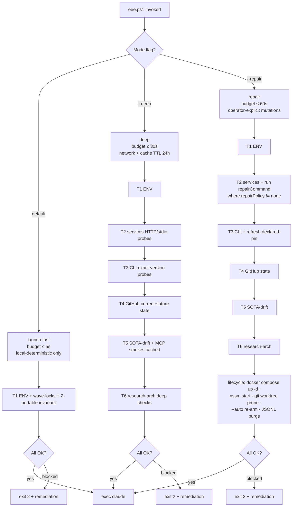

# W393 — eee.ps1 clean-SOTA launch contract (design landing)

> **Status**: W393 codex r5 APPROVE@0.94 · design landed via PR #64 (W400) @ commit `9f3ea24` · implementation plan W401 (8 PRs / 4 DAG waves; pending merge). Authoritative design: [`docs/superpowers/specs/2026-05-25-W393-eee-contract-design.md`](../../superpowers/specs/2026-05-25-W393-eee-contract-design.md). Operator runbook + config reference land in Wave-4 (W393.8b).

---

## Overview

The `eee.ps1` launch contract is a thin PowerShell launcher (~50 LOC) that invokes a Node.js precheck orchestrator (`tools/eee-precheck.mjs`) before starting Claude Code. The contract runs as `validate → auto-heal-safe-local → block-on-critical` on every interactive session start; it gates the runtime against drift in the 6 enforcement tiers (T1 ENV / T2 services / T3 CLI tools / T4 GitHub state / T5 SOTA-drift derived from `.mcp.json` / T6 research architecture). The PowerShell layer is intentionally kept thin to prevent 1k+ LOC launcher-accretion; all check logic lives in Node.js per-tier modules under `tools/eee-checks/` so each tier can evolve independently (e.g., the MCP RC 2026-07-28 stateless-transport swap is a one-module change). Auto-heal is `safe-local-idempotent only` by default — every git, GitHub-lifecycle, or service-supervisor mutation requires explicit `eee --repair`, never silent. Research-architecture (T6) is given a dedicated tier per operator emphasis on this meta-architecture that gates every future-evolve cycle's quality.

---

## 3-mode tiering — flowchart

**Mode contracts** (per design §1-§3):

| Mode flag | Latency budget | Network | Tiers run | Lifecycle mutations | When to use |
|---|---|---|---|---|---|
| `eee` (default) | ≤ 5 s | NO | T1 + roster scan | safe-local-idempotent only (cache reload, MCP stdio re-handshake, dead-PID wave-lock unlock) | Every interactive launch |
| `eee --deep` | ≤ 30 s | YES (TTL 24 h) | T1 + T2 + T3 + T4 + T5 + T6 | same as default | Daily / pre-PR / after long pause |
| `eee --repair` | ≤ 60 s | YES | all tiers + repair-commands | full lifecycle (`docker compose up -d`, `nssm start <svc>`, `git worktree prune`, `--auto` re-arm, stale JSONL ≥30d prune) | After PR merge, after suspend-resume, after service crash |

---

## 6-tier precheck matrix

| Tier | What it checks | launch-fast | --deep | --repair | Blocking |
|---|---|---|---|---|---|
| **T1 ENV** | Env vars from CLAUDE.local.md + settings.json + .mcp.json env-interp · Z-portable invariant (HOMEDRIVE=Z:, no C-leak) · wave-lock state · gitignore safety · BASH_ENV target readable · state-dir JSON validity · stale-session JSONL inventory | full | full | full + lifecycle-prune JSONLs ≥30 d | **required** — block on any missing required env / lock collision |
| **T2 Services** | Typed-service descriptors (langfuse / cognee / ollama / llamaswap / falkordb / phoenix) · transport (stdio/http/grpc) · supervisor (docker-compose / nssm / uvx-stdio / manual) · `repairPolicy` separated from launch-mode | roster validation only | HTTP/stdio health-probe via `healthProbe` URL | invoke `repairCommand` where `repairPolicy != none` (`docker compose up -d langfuse`, `nssm start CogneeMCP`) | **required** for services with `blocking: required`; **advisory** for falkordb (W295 retirement), phoenix (running-but-unwired per W392 audit) |
| **T3 CLI tools** | Exact version probes for node ≥22, python ≥3.13, gh + auth scopes (repo, workflow, admin:read), codex ≥0.130, claude ≥2.1.144 (settings.json:minimumVersion), gitleaks ≥8.30, lefthook ≥2.x, pinact ≥3.x, pre-commit ≥4.x, trufflehog ≥3, osv-scanner ≥2, typos · post-W392 advisory tagging for poutine / mcp-scan / opengrep / knip / markdownlint-cli2 · W389-Phase-0a advisory tagging for inspect-ai / deepeval / promptfoo | full | full | full + refresh npm/pypi pin to **declared** version on cache-corrupt (NEVER auto-bump to latest) | **required** for confirmed-installed tools; **advisory until cited wave PR lands** for the post-W392 + W389 sets |
| **T4 GitHub state** | CURRENT: ruleset `main-branch-protection-sota` active · 5 required checks present · Codex-Verdict honest behavior (skips when `OPENAI_API_KEY_AVAILABLE != true`, fails ONLY on `VERDICT: BLOCK`) · gh auth scopes · no `.git/rebase-merge/` · recent merge proof. FUTURE-state advisory: Copilot Coding Agent enabled · skip-approval · 2-ruleset bypass split · merge_queue · SOTA Stream C Slot A-E pluggable-peer presence | (skipped) | full CURRENT + FUTURE-state advisory | same as --deep | **required** for current-state checks; **advisory** for FUTURE post-public-org checks |
| **T5 SOTA-drift** | MCP roster derived dynamically from `.mcp.json.mcpServers` (skip `disabled:true`) · per-server metadata (`required` / `advisory` / `credential-gated`) · stale-ref scan vs CLAUDE.md skill count + `.mcp.json _comments` + `tools/lib/sca-telemetry-core.mjs:69` currentVersion + sca-v22 schema · L11 Langfuse trace ingestion within 24h · L19 supply-chain (attest-build-provenance / SBOM / Scorecard / pinact) · L20 AI-safety (mcp-scan / poutine / Garak) · L22 eval+bench wiring · **memory-tier-arbitration** (T6 basic-memory canonical / T3 cognee / T7 mem0-planned / T4 graphiti-retired / AGPL-blocked khoj) | roster validation only (no network) | full + per-server smoke cached TTL 24 h | same as --deep | **required** on stale-ref findings; **advisory** for L19-L22 forward-readiness rows |
| **T6 Research architecture** | sca-v22 file manifest (`tools/sota-discovery/discover.mjs` + `evaluate-v22.mjs` + `lib/{convergence, decision, compare, contract}.mjs` + `lib/fetchers/osv.mjs` + 8 discovery modules + 255 tests + sca-v22 schema) · `gh-cascade.sh` + `duckdb-hf-hub-stats.sql` Stage-0.5 anti-popularity-bias bypass · RDOE schema-firewall (W381 §5: discovery → rubric only via `CandidateDossier`) · AdaptOrch DAG retrofit · GPT-Researcher MCP wiring (when W389 Phase-0a #5 lands) · discovery-cache freshness (sca-v22 runs < 30 d) · verdict-ledger discipline · **multi-convergence routing rule** (≥2 engines from {gpt-researcher, STORM, dzhng, local-deep-researcher, paper-qa, DeerFlow, ARIS, autoresearch} + ≥3 distinct sources before adoption-decision) · **install-priority roster** (gpt-researcher / ARIS / autoresearch / DeerFlow / STORM / DeepResearchAgent) | (skipped) | full · **advisory-until-baseline** mode where W384 files absent | same as --deep | **advisory** until W384 baseline lands on operator's main; promotes to **required + B7** when files present + schema valid + smoke-tests pass |

---

## 10 block-rules (B1-B10)

| Id | Trigger | Remediation |
|---|---|---|
| **B1** | leaked-cred in tracked/staged file | `gitleaks protect --staged --redact`; remove from git history if already committed |
| **B2** | CR-2 / CR-5 unsanctioned hook (new `.claude/hooks/` file >2 KB or without CLAUDE.md cite-anchor) | Add CR-5 cite-anchor row in CLAUDE.md (10 per-hook criteria per W392 P2.9) or retire the hook |
| **B3** | sca-v N drift (telemetry constant, schema file, or gate references inconsistent with canonical) | Reconcile to canonical `sca-v22` per W392 P0.1 sweep |
| **B4** | Docker daemon down WHEN required (in `--deep` or `--repair` mode) | Start Docker Desktop or `nssm start docker`; **advisory** in default `eee` mode (Docker named-pipe denies non-admin contexts) |
| **B5** | wave-lock collision — alive PID holds the same wave name | Use `tools/eee.ps1 --Wave Wn --Slug s` (W363) to claim a fresh wave number |
| **B6** | GitHub auth expired | `gh auth login --scopes repo,workflow,admin:read` |
| **B7** | Research-arch broken (files present + smoke-tests fail or schema absent) | Restore sca-v22 per W384 PR #44 @ `2a37eb7`. Until W384 lands on main, T6 is **advisory** (no block) |
| **B8** | RDOE schema-firewall breached (discovery → rubric path bypasses `CandidateDossier` validation; checked once `contract.mjs` lands) | Re-add firewall per W381 §5 |
| **B9** | Critical-stale MCP version — `.mcp.json` declared pin vs locally-installed differs by major version (security review) | `npm install -g <pkg>@<declared-pin-version>` |
| **B10** | GitHub Action SHA-pin floating in required-check workflow path (post-W392 P3.2 lands) | `pinact run` to repin floating refs to commit SHAs |

---

## Implementation phases

The 8-PR / 4-wave AdaptOrch DAG implementation plan is at [`docs/superpowers/plans/2026-05-25-W393-phase-0a-implementation-plan.md`](../../superpowers/plans/2026-05-25-W393-phase-0a-implementation-plan.md) (lands via W401 admin-wave PR #69 — currently merging in parallel; this link resolves once #69 lands on main).

Wave summary:

- **Wave-1** (parallel × 2) — **W393.1** thin launcher + Node skeleton + T1 ENV · **W393.8a** (this PR) design-landing docs.
- **Wave-2** (parallel × 5; depends on W393.1 skeleton) — **W393.2** T2 typed-service descriptors · **W393.3** T3 CLI exact-probes · **W393.4** T4 GitHub current-vs-future + Slot A-E advisory · **W393.5** T5 SOTA-drift + memory-tier-arbitration · **W393.6** T6 research-arch + multi-convergence routing.
- **Wave-3** (sequential after Wave-2) — **W393.7** B1-B10 block-rules + remediation surface + comprehensive test harness.
- **Wave-4** (sequential after Wave-3) — **W393.8b** operator runbook + `.eee/precheck-config.json` reference.

Total: 8 PRs · aggregate within-wave parallel-ratio = 1.0 (max possible).

---

## Sources

### Anthropic Claude Code docs (≥2 distinct Anthropic URLs)

- `https://docs.anthropic.com/en/docs/claude-code/` — Claude Code overview, memory, hooks, sub-agents.
- `https://code.claude.com/docs/en/sandboxing` — sandboxing semantics referenced by cardinal rule 5.
- `https://code.claude.com/docs/en/plugins` — plugin install + trust-tuple cited by cardinal rule 1.
- `https://code.claude.com/docs/en/skills` — local operator-curated skills path (cardinal rule 3).
- `https://www.anthropic.com/engineering/multi-agent-research-system` — Anthropic engineering blog: Opus-lead + Sonnet-subagents pattern cited by design §7 (90.2 % gain per W389 Stream B).

### GitHub Code Security + Copilot Coding Agent

- `https://docs.github.com/en/code-security` — Code-security feature overview.
- `https://docs.github.com/en/repositories/configuring-branches-and-merges-in-your-repository/managing-rulesets` — ruleset semantics underlying T4 current-state checks.
- `https://docs.github.com/en/repositories/configuring-branches-and-merges-in-your-repository/configuring-pull-request-merges/managing-a-merge-queue` — merge-queue (post-public-org advisory).
- `https://github.blog/changelog/2026-03-13-optionally-skip-approval-for-copilot-coding-agent-actions-workflows/` — skip-approval setting cited by T4 FUTURE-state.
- `https://docs.github.com/en/copilot/concepts/agents/cloud-agent/about-cloud-agent` — Copilot Coding Agent reference (T4 FUTURE).
- `https://docs.github.com/en/code-security/how-tos/secure-your-supply-chain/establish-provenance-and-integrity/preventing-changes-to-your-releases` — Immutable Releases (T5 L19 forward-readiness).

### Other upstream standards / OSS tooling

- `https://blog.modelcontextprotocol.io/posts/2026-07-28-release-candidate/` — MCP RC 2026-07-28 stateless protocol (release-candidate status; T2 scaffold ready).
- `https://a2aproject.org` — A2A protocol (Linux Foundation, 22k+ stars; T4 FUTURE pluggable-peer Slot A-E).
- `https://learn.microsoft.com/en-us/agent-framework/overview/` — Microsoft Agent Framework 1.0 (public-preview; Slot A).
- `https://github.com/assafelovic/gpt-researcher` — GPT-Researcher MCP (T6 install-priority #1).
- `https://github.com/stanford-oval/storm` — STORM / Co-STORM (T6 multi-convergence academic engine).
- `https://github.com/bytedance/deer-flow` — DeerFlow 2.0 (T6 sandbox-aware engine).
- `https://github.com/ossf/scorecard` + `https://github.com/suzuki-shunsuke/pinact` — OSSF Scorecard + pinact (T5 L19 supply-chain).
- `https://github.com/evilmartians/lefthook` — Lefthook (T3 required tool).
- `https://github.com/gitleaks/gitleaks` — gitleaks (T3 + B1 trigger).

### Internal wave references

- `Z:/claude-sota-installed/CLAUDE.md` — cardinal rules CR-1..CR-6 (cite-anchored to Anthropic docs).
- `Z:/claude-sota-installed/CLAUDE.local.md` — env-block authority for T1 enforcement.
- W363 — `tools/eee.ps1 --Wave Wn --Slug s` wave-lock acquisition pattern (cited by B5 remediation).
- W381 Unleashed-Autonomy §5 — RDOE schema-firewall pattern cited by T6 + B8.
- W384 — sca-v22 baseline (255 tests on main @ `2a37eb7`) cited by T6 manifest + B7 remediation.
- W385 / W386 / W387 / W388 / W389-design+plan / W392-cleanup-design — lineage `b1c625e`(W392 #60) ← `0854eceb`(W391) ← `a5b82471`(W389) ← `2a37eb7`(W384) ← `06a169c`(W381).
- W387 — live ruleset `main-branch-protection-sota` ACTIVE on `~DEFAULT_BRANCH` referenced by T4 CURRENT.
- W389 Phase-0a #5 + #6 + #12 — GPT-Researcher MCP install · AdaptOrch DAG retrofit · drift-eval cadence (T6 forward-readiness).
- W392 P0.1 sweep — sca-v22 telemetry / schema / gate references (T5 stale-ref scan, B3 remediation).
- W400 PR #64 @ `9f3ea24` — W393 design merged to main (this README's source-of-truth).
- W401 PR #69 — W393 Phase-0a implementation plan (in-flight at time of writing).

---

*This is the design-landing overview. The operator runbook + `.eee/precheck-config.json` schema reference land in Wave-4 as W393.8b.*
